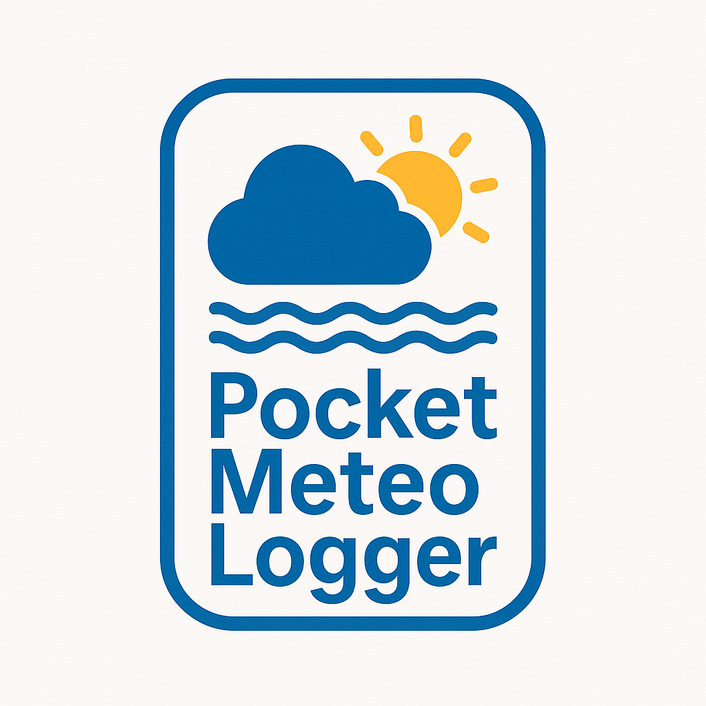
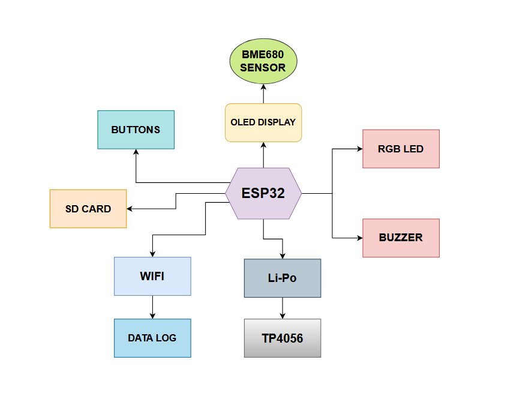
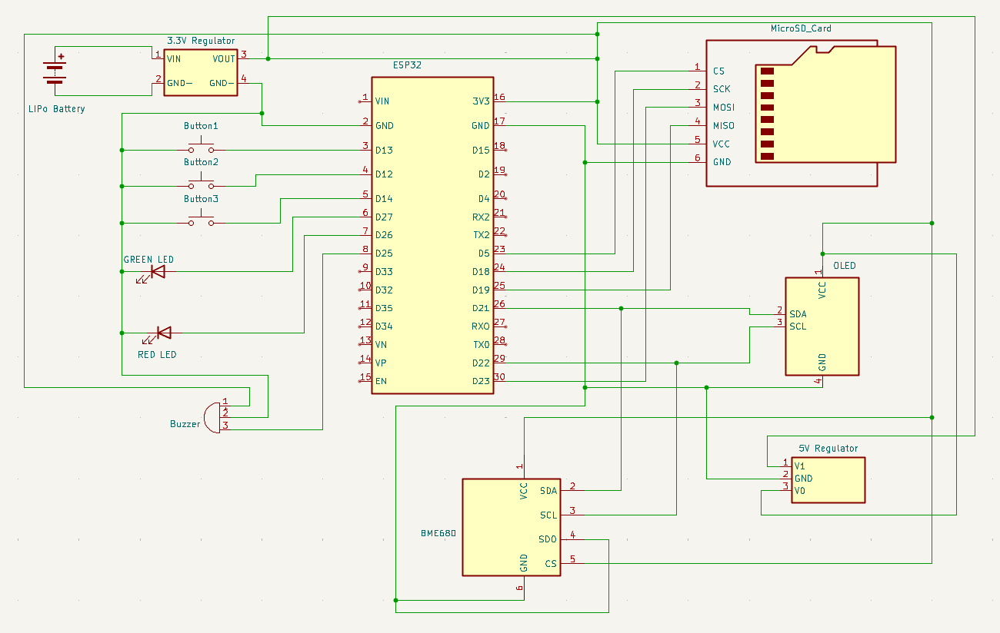
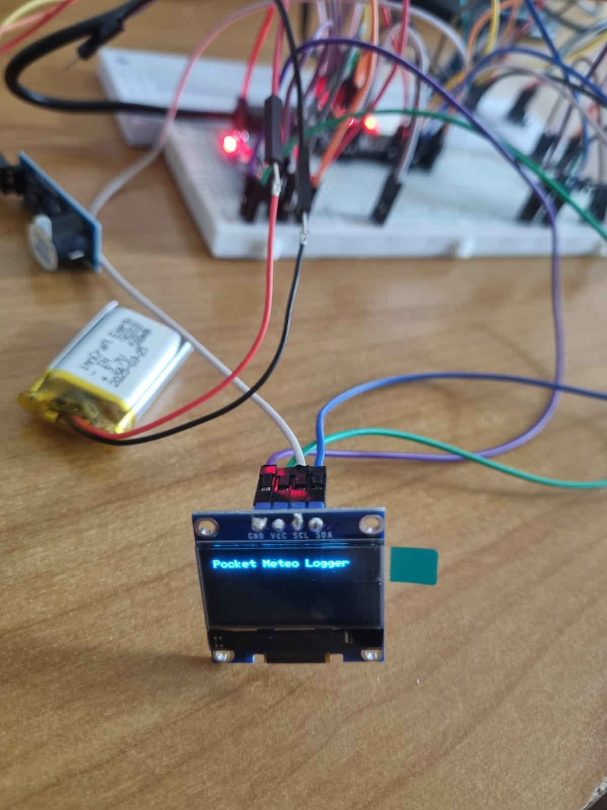
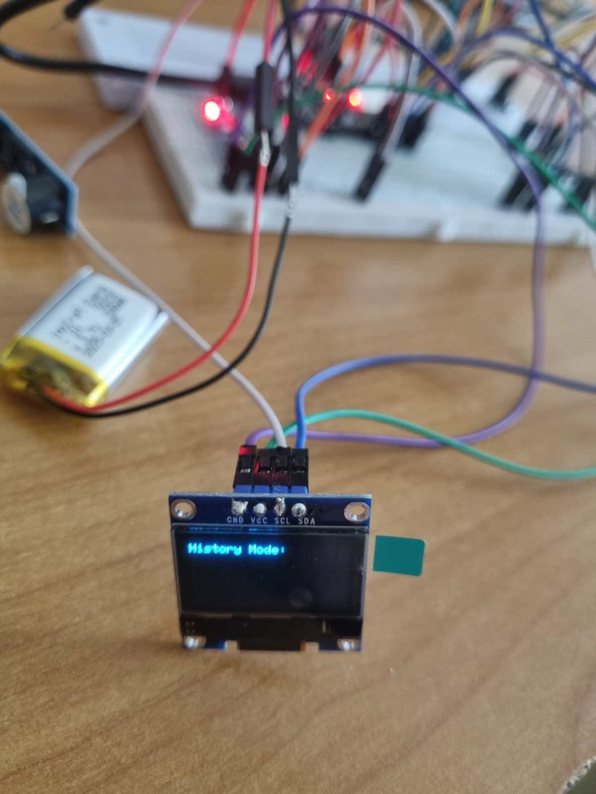
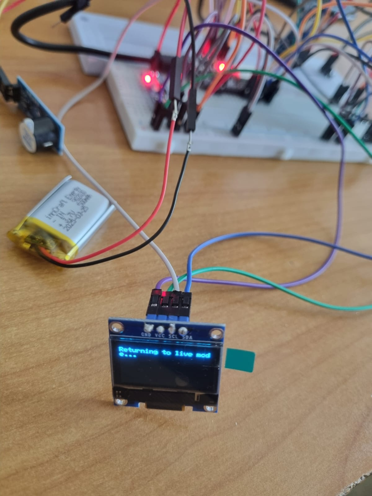
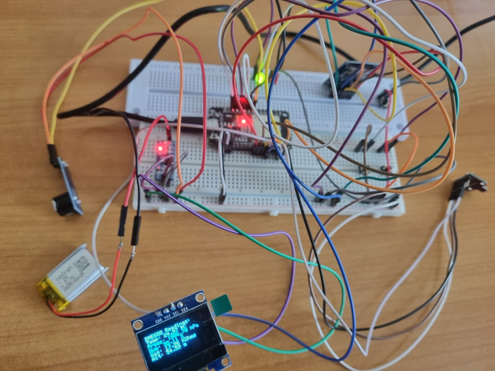
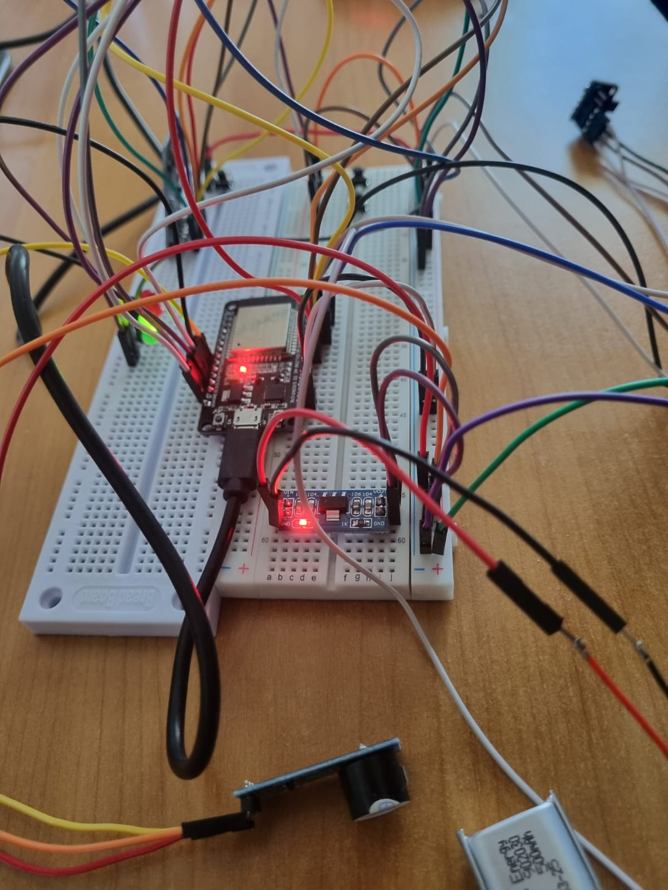
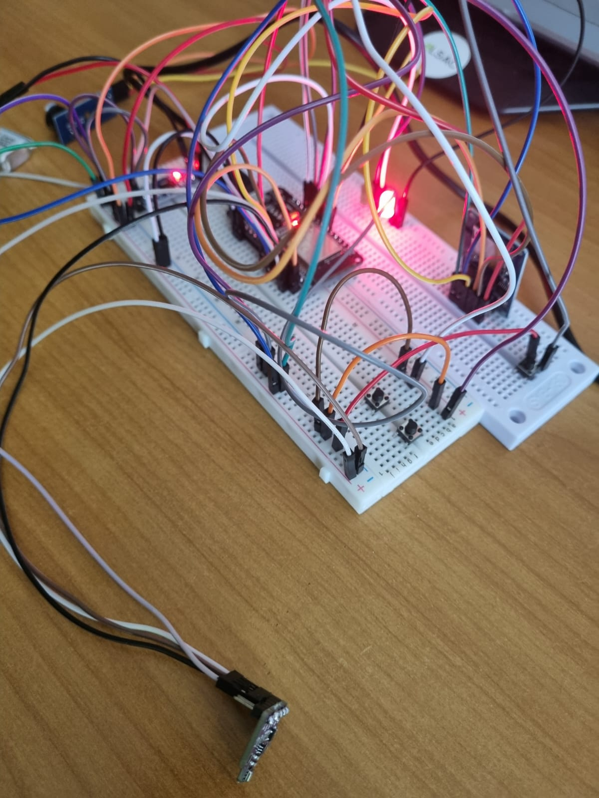

# Pocket Meteo Logger

**Name:** Duca Andrei-Rares  
**Group:** 331CA

## Introduction

**Pocket Meteo Logger (PML)** is a hand-held, battery-powered micro-station that continuously measures local weather and air-quality parameters – temperature, relative humidity, barometric pressure, equivalent VOC / CO₂ level and particulate-matter concentration.

**The device offers three core services:**

- **Live feedback** – numeric values, trend arrows and status icons are displayed on a 0.96″ OLED screen, offering instant readings without needing a phone or laptop.
- **Context-aware alerts** – a tiny buzzer and two RGB status LEDs signal critical changes in air quality or environmental conditions.
- **Long-term logging** – every minute, fresh samples are time-stamped; the data are either cached to a micro-SD card (offline trips) or, when Wi-Fi is available, pushed to a Google Sheets cloud spreadsheet for later analysis.

The project started from hiking and cycling needs: a reliable field barometer, an AQI indicator and a silent logger that do not depend on a phone’s battery. Because **PML** is fully open-source, hikers, air-quality hobbyists or students can reuse both hardware and firmware to build their own variants — adding extra sensors, changing alert rules or integrating it into larger IoT systems.

Powered by a single Li-Po cell, **PML** fits in a shirt pocket, survives multiple days on one charge and re-charges via USB. Three tactile buttons let the user browse current values and the last-hour history directly on the OLED display, without any external device.

## General Description

**Pocket Meteo Logger** is designed as a compact, battery-powered weather station you can carry anywhere. It wakes up every minute, collects environmental data from onboard sensors, displays the results on a tiny OLED screen, stores the readings locally or uploads them online — and then quietly returns to sleep to preserve energy.

The system is built from a clear split of **hardware modules** (sensors, display, storage, alerts) and **software components** (data collection, user interface, alerts, power handling), each focused on a specific role. Together, they create a responsive, energy-efficient logger that offers both **real-time monitoring** and **offline browsing**, with minimal user interaction.

### Hardware Modules

| Module             | Role                                                                 |
|--------------------|----------------------------------------------------------------------|
| ESP32 Dev Board    | Main microcontroller with built-in Wi-Fi; handles all processing, sensor communication, sleep logic, and cloud sync |
| BME680 combo-sensor| All-in-one sensor for temperature, humidity, pressure, and air quality (VOC) via I²C |
| 0.96″ OLED Display | Ultra-low-power screen for showing live values and recent history even when asleep |
| MicroSD Card Slot  | Used for saving CSV logs when Wi-Fi is unavailable or as offline backup |
| Buzzer & RGB LED   | Provide alert sounds and color-coded warnings for high pollution or temperature levels |
| Tactile Buttons    | Allow user to navigate data, view logs, or set alert thresholds |
| Power System       | Includes Li-Po battery, USB-C charging via MCP73832, and voltage regulators for sensors |

### Software Modules

| Module             | Role                                                                 |
|--------------------|----------------------------------------------------------------------|
| Sensor Drivers     | Low-level communication with sensors (I²C and UART), returning calibrated readings |
| Sampling Scheduler | Wakes up the device once per minute and starts the data collection sequence |
| Data Logger        | Stores samples locally (CSV on SD) or sends them to Google Sheets via HTTPS when Wi-Fi is present |
| Alert Engine       | Monitors values and triggers buzzer/LED alerts when readings exceed set thresholds |
| Display Manager    | Handles screen updates, rendering current values and past samples efficiently |
| UI Handler         | Reads and debounces button presses; manages menu navigation and selection via a state machine |
| Power Manager      | Controls sleep/wake transitions, turns off unused peripherals to save battery |

## How They Interact

- **Wake-up tick** – The RTC timer inside the ESP32-C3 wakes the system every minute or on button press.
- **Sensor sweep** – The sampling scheduler triggers the sensor drivers to collect fresh data from the BME680.
- **Alerts** – If any environmental value exceeds a preset threshold, the alert engine activates the buzzer and RGB LED.
- **Display update** – The display manager updates the OLED screen with the latest readings and a short historical graph.
- **Log / Upload** – The data logger writes the values on the microSD card or uploads them to Google Sheets via Wi-Fi.
- **Back to sleep** – After a few seconds of inactivity, the power manager disables all peripherals and puts the ESP32 back into deep-sleep mode.

## Block Diagram

## Hardware Design

### Component List

- ESP32 Development Board
- BME680 Sensor
- 0.96″ OLED Display
- MicroSD Card Module
- MicroSD Card 2GB
- Piezo Buzzer
- Red, Green, Yellow LEDs
- 3 × Tactile Push Buttons
- 3.3V Power Supply Module (LDO)
- TP4056 Battery Charger Module
- Li-Po Battery 500mAh
- 5V Boost Converter
- Breadboard 750 points
- Jumper Wires (M/M, M/F, F/F)

### Images

## Simulation Results

The system was verified both via serial monitor and actual hardware feedback.

**Validation included:**

- Real-time sensor reading confirmation (temperature, pressure, humidity, gas).
- Wi-Fi connection attempts and logging.
- Local CSV logging and Google Sheets sync.
- OLED screen feedback and navigation using buttons.
- Alerts with buzzer and LEDs based on thresholds.

## Software Design

### Software Status

- Fully implemented and tested on the ESP32 using Arduino IDE.

### Libraries Used

| Library                 | Purpose                                                                 |
|-------------------------|-------------------------------------------------------------------------|
| Adafruit_BME680         | Sensor handling and calibration                                         |
| Adafruit_GFX + SSD1306  | OLED display graphics and text rendering                               |
| WiFi.h                  | Network interface                                                       |
| HTTPClient.h            | Cloud communication via POST                                            |
| FS.h, SD.h              | File system support on SD card                                          |
| Wire.h, SPI.h           | I²C and SPI communication                                               |

## Innovation and Novelty

- **Offline autonomy** with OLED history navigation
- **Cloud sync** via Google Sheets
- **Real-time alerts** without external app
- **Modular architecture** for flexible reuse

## Project Architecture

### 1. Setup

- Initialize sensors, display, SD card, Wi-Fi
- Setup GPIO and UI state

### 2. Loop

- Handle history/live mode switch
- Fetch sensor data every 30s
- Update OLED
- Store data to SD
- Upload if Wi-Fi available
- Trigger alerts if needed

### 3. Module Interaction

| Module                   | Trigger        | Output                                             |
|--------------------------|----------------|----------------------------------------------------|
| tryConnectWiFi()         | loop           | Wi-Fi reconnect logic                              |
| performReading()         | timer (30s)    | Sensor values                                      |
| sendDataToGoogleSheets() | if Wi-Fi       | Cloud sync                                         |
| appendToSD()             | post-reading   | Local CSV line                                     |
| display.printf()         | update action  | OLED refresh                                       |
| Buzzer & LEDs            | threshold check| Feedback alerts                                    |

## Sensor Calibration

### BME680:

- Temperature: factory-calibrated, oversampling 8x
- Pressure: oversampling 4x
- Humidity: oversampling 2x
- Gas: burn-in for 5-10 mins, heater at 320°C 150ms
- Altitude: derived from pressure with sea level ref.
- IIR filter: Size 3

### Buttons:

- 'delay(200)' after input to debounce
- 'delay(500)' on mode switch to avoid accidental triggers
- Pull-up resistors via 'INPUT_PULLUP'

## Optimizations

### Code

- Modular design
- Non-blocking logic
- Efficient string formatting with buffers
- OLED updates only on changes

### Hardware

- Ultra-low-power components
- Internal pull-ups for buttons
- Future-ready deep sleep architecture

### Lab Concept Usage

- I²C & SPI bus shared properly
- GPIO UI with debounce
- Modular FSM for navigation

## Demo Video

## Conclusions

Pocket Meteo Logger is a complete embedded IoT device integrating environmental sensing, local and cloud-based data storage, and a full user interface — powered by Arduino and ESP32.

## Bibliography / Resources

- [ESP32 + BME680](https://randomnerdtutorials.com/esp32-bme680-sensor-arduino/)
- [ESP32 + OLED Display](https://randomnerdtutorials.com/esp32-ssd1306-oled-display-arduino-ide/)
- [ESP32 + microSD Card](https://randomnerdtutorials.com/esp32-microsd-card-arduino/)
- [ESP32 Web Server + SD](https://randomnerdtutorials.com/esp32-web-server-microsd-card/)
